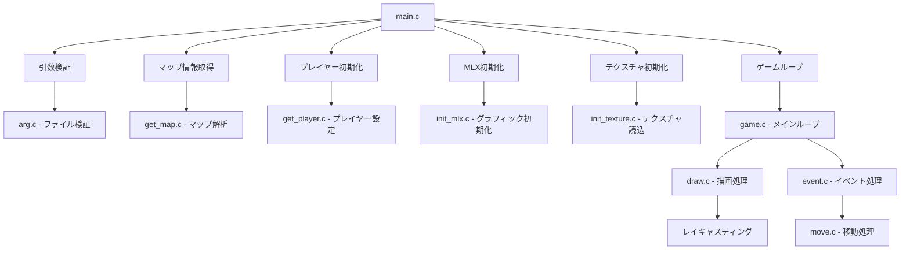

# cub3D

3Dレイキャスティングゲームエンジンの実装プロジェクト

## 概要

cub3Dは、古典的なレイキャスティング技術を使用して3D視点の迷路ゲームを作成するプロジェクトです。Wolfenstein 3Dスタイルの第一人称視点でマップを探索できます。

## 機能

- **3Dレイキャスティング**: リアルタイムで壁の描画を行う
- **テクスチャマッピング**: 各方角（北、南、東、西）に異なるテクスチャを適用
- **プレイヤー移動**: WASD キーによる移動と矢印キーによる視点回転
- **色彩設定**: 天井と床の色をRGB値で指定可能
- **マップ検証**: 入力されたマップファイルの妥当性チェック

## システム要件

- macOS または Linux
- MinilibX ライブラリ
- C コンパイラ（gcc 推奨）
- Make

## インストール・ビルド

```bash
# リポジトリをクローン
git clone [repository-url]
cd 42_cub3d

# プロジェクトをビルド
make

# 実行
./cub3D maps/simple.cub
```

## 使用方法

### キー操作

| キー | 機能 |
|------|------|
| `W` | 前進 |
| `S` | 後退 |
| `A` | 左移動 |
| `D` | 右移動 |
| `←` | 左回転 |
| `→` | 右回転 |
| `ESC` | ゲーム終了 |

### マップファイル形式

マップファイル（.cub）は以下の要素で構成されます：

```
NO ./texture/north_texture.xpm
SO ./texture/south_texture.xpm
WE ./texture/west_texture.xpm
EA ./texture/east_texture.xpm

F 220,100,0
C 225,30,0

111111
100101
101001
1100N1
111111
```

- `NO`, `SO`, `WE`, `EA`: 各方角のテクスチャファイルパス
- `F`: 床の色（RGB）
- `C`: 天井の色（RGB）
- マップ: `1`（壁）、`0`（空間）、`N/S/E/W`（プレイヤーの初期位置と向き）

## プロジェクト構造



### 主要ファイル

- **main.c**: プログラムのエントリーポイント
- **arg*.c**: 引数とマップファイルの検証
- **get_map*.c**: マップデータの読み込みと解析
- **get_player.c**: プレイヤーの初期位置・向きの設定
- **init_*.c**: MLXとテクスチャの初期化
- **game.c**: メインゲームループ
- **draw*.c**: レイキャスティングと描画処理
- **event.c**: キーボードイベントの処理
- **move*.c**: プレイヤーの移動と回転
- **include/cub3d.h**: 全体の構造体・関数定義

## 使用可能な関数

- `open`, `close`, `read`, `write`
- `printf`, `malloc`, `free`
- `perror`, `strerror`, `exit`
- `gettimeofday`
- 数学ライブラリ関数（`-lm`）
- MinilibX ライブラリ関数
- 自作 Libft ライブラリ関数

## 作者

**kmiyazaw** と **kisobe** による共同開発プロジェクト

## 開発履歴

プロジェクトの詳細な開発履歴については [DEVLOGS.md](./DEVLOGS.md) をご覧ください。

## ライセンス

このプロジェクトは42学校の課題として作成されました。